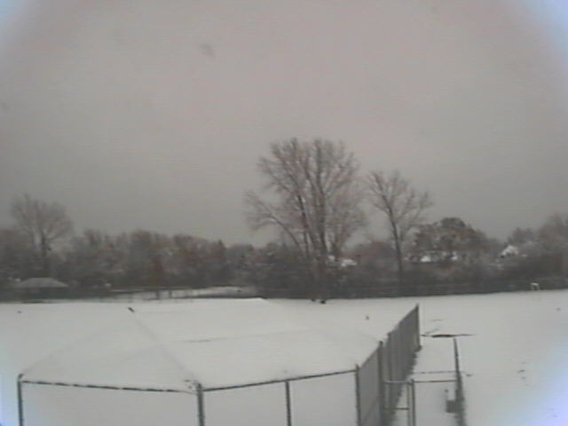
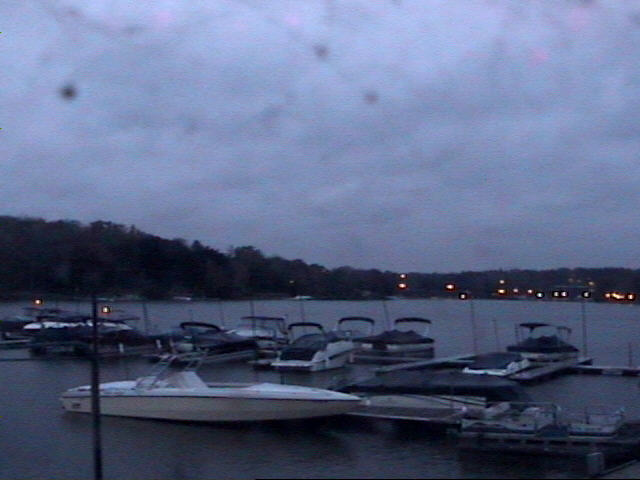

# About the source code
* PARAMETERS
    * In order to correctly execute the codes, some parameters must be configured as described below.
    * In util.py
        * Paths of the datasets;
        * num_cores: used in processing. All the 'hot' functions of this work were paralleled, and all use this parameter;
    * In train.py
        * MODEL_ACTION
            * TEST_ALL_CLASSIFIERS - Tests all classifiers under selected features;
            * TEST_BIG_CLASSIFIER  - Train/Test the 'big' classifier presented and explained in the paper;
                * IMAGE_ROTULATION - Labeling of New images with the 'big' classifier, being the image added to the dataset only if all classifiers labeled with the same class;
                * AMOS - Labeling data of the dataset AMOS;

* The files have documentation summarized in all their functions.

* Files
    * deep_learning_train.py: Train CNNs with fine tuning;
    * feature_extraction_CNN.py: Feature extraction with CNNs;
    * feature_extraction.py: Feature extraction with histogram, co-matrix e LBP;
    * process_dataset_AMOS.py: Data processing functions for the AMOS dataset;
    * process_dataset_nexet.py: Data processing functions for the Nexet dataset;
    * process_dataset_transient.py: Data processing functions for the Transient dataset;
    * train.py: Train all classifiers (the features have already been extracted, except in the case of deep models);
    * util.py: Several "general purpose" functions that were required during this work;
    * vgg16_places_365.py: Pre-trained model vgg16_places_365.

# Night-Day Image Classification

For more information, read Report.pdf (in Portuguese) or contact me.

### Datasets
* Transient (http://transattr.cs.brown.edu/);
* AMOS (http://cs.uky.edu/~jacobs/datasets/amos/);
* Barcelona (http://www.cs.unc.edu/~jtighe/Papers/ECCV10/);
* Places (https://ieeexplore.ieee.org/document/7968387).

## Extracted Samples

### 
 Day 

  

  

### 
 Transition 

  

  

### 
 Night 

  

  

### Features extraction

(I) - Histogram
(II) o GLCM. 
F1-score over 20% of the data - cross validation.

| Classifier       |   I       |   II      |   I + II    |
| ---- | ------| ------| -----|
| Linear SVM          |   84.81% |   88.70% |   90.85%   |
| Decision Tree       |   82.17% |   82.52% |   85.39%   |
| Random Forest       |   88.89% |   88.87% |   90.81%   |
| Neural Network      |   87.72% |   92.18% |   91.74%   |
| Naive Bayes         |   79.05% |   68.89% |   69.66%   |
| Logistic Reg        |   84.80% |   86.66% |   90.69%   |

(III)  - Local Binary Pattern (LBP)

| Classifier       |   III     |   II + III  |  I + II + III  |
| -----| ------| ------| ------|
| Linear SVM          |   82.82% |   89.39% |   90.15%|
| Decision Tree       |   76.66% |   84.44% |   84.67%|
| Random Forest       |   80.00% |   91.36% |   90.72%|
| Neural Network      |   84.92% |   92.89% |   92.28%|
| Logistic Reg        |   83.18% |   87.98% |   88.57%|

### Features from deep model

| Classifier       |   ResNet50    |   IncV3       |  Xcp  |
| ---------| --------| -----------| -----------| 
| Linear SVM          |   94.77%     |   92.66%     |   91.85%|
| Random Forest       |   91.87%     |   79.39%     |   76.17%|
| Neural Network      |   95.73%     |   91.68%     |   90.20%|
| Logistic Reg        |   95.24%     |   68.79%     |   80.07%|

### Increasing the dataset

  

## Aprimoramento do modelo

Para a construção do modelo final deste trabalho, inicialmente será retreinado o modelo utilizado na rotulação de dados e acrescida a utilização de meta learning.

### Meta Learning

O retreinamento do modelo com o dataset completo obteve melhores resultado, sendo descritos na tabela abaixo os valores por cada classificador enumerados de 1 a 7.

| Classificador   |   accuracy    |   f1-score | 
| ------| -------| ------| 
| 1               |   94.39%     |   94.39%     |
| 2               |   95.79%     |   95.76%     |
| 3               |   94.20%     |   94.20%   | 
| 4               |   95.98%     |   95.96%     | 
| 5               |   94.84%     |   94.80%     |
| 6               |   97.51%     |   97.50%     |
| 7               |   97.45%     |   97.44%   |  

Na próxima etapa, os resultados obtidos são repassados a outro classificador que será utilizado para definir a classe final para cada exemplo. Ao ser utilizado o meta learning novos e melhores resultados foram obtidos, como pode ser observado na tabela abaixo, se comparado com o voto majoritário.

| Classificador       |   accuracy   |   f1-score   |
| -----------| ---------| ---------------|  
| Linear SVM          |   97.13%     |   97.13%     |
| Decision Tree       |   98.08%     |   98.08%     |
| Random Forest       |   98.02%     |   98.02%     |
| Neural Network      |   96.68%     |   96.70%     |
| Logistic Reg        |   96.81%     |   96.82%     | 

### Transfer Learning - ResNet50 com ImageNet

Como a extração de features pelo ResNet50 treinado com o ImageNet apresentou bons resultados, e tendo o dataset com maior quantidade de imagens, prosseguiu-se o experimento para utilizar transfer learning por meio do fine-tuning, que consiste no processo de ajustar as redes treinadas em um dataset para o treinamento com o outro dataset selecionado.

A fully connected layer do ResNet50 foi removida e substituída por novas camadas, conforme apresentado na figura abaixo, sendo estas escolhidas devido a apresentarem os melhores resultados, após ser realizados experimentos com outras configurações.

  

Como resultado desse processo treinado por sete epochs, obteve-se 90% de accuracy e 0.2789 de loss no conjunto de treinamento, e 80% de accuracy e loss de 1.2179 no conjunto de validação. Ajustando este modelo, conseguiu-se atingir uma accuracy de até 98% sobre o conjunto de treinamento, porém na validação este resultado apresentou decréscimo indicativo de overfitting sendo a accuracy de apenas 60%.

### Trasnfer Learning - VGG16 com Places

Para este experimento foi utilizado umas das CNNs treinadas com o dataset Places disponibilizas por Zhou(2017), sendo denominada VGG16_Places365. Esta CNN consiste em uma VGG16 com fine-tuning para as classes dos Places, ou seja, 365 classes. A escolha desta CNN justifica-se devido ao conteúdo das imagens serem mais apropriadas para cenário desse trabalho, visto ser imagens para reconhecimento de cenários.

O fine-tuning realizado nesta CNN, assim como o anteriormente utilizado, remove as camadas do topo (fully connected layer), e com a saída obtida pelo VGG, adiciona novas camadas, conforme apresentado na Figura\,\ref{fig:vgg, para então realizar a classificação.

  

Após realizar o treinamento por uma epoch tendo 90% das camadas do modelo congeladas e utilizando optimazer rmsprop, obteve-se os resultados de apresentados na tabela abaixo. Ressalta-se que adicionar mais epochs não representou melhora significativa dos resultados.

| Treinamento | Validação |
| ----- | ------ |
| Loss   | Accuracy    |    Loss           |  Accuracy             | 
| 0.3222 |      97.14% |    0.3469         |    96.07%             | 

### Modelo Final

Para o modelo final, foram utilizados os sete classificadores definidos nas seções anteriores, acrescido com o VGG16_Places365 com fine-tuning, que foi escolhido por ter sido treinado com dataset Places e por apresentar accuracy superior a alguns dos outros classificadores. Neste ponto, descartou-se o ResNet50 com fine-tuning, pois além de não ter apresentado bons resultados ele já esta sendo utilizado na extração de features.

O resultado obtido com a rede de oito classificadores, é enviado a outro classificador (Logistic Regression) no final da rede, apresentando accuracy de 98.83% e f1-score de 98.53,  sobre o conjunto de validação.

## Resultados

Para o modelo anterior, foi realizada a predição sobre o conjunto de teste (aproximadamente mil imagens). Os resultados obtidos podem ser visualizados na figura abaixo, enquanto na tabela abaixo  apresenta-se a  confusion matrix.

  

|           | Predict Dia | Predict Noite | Predict Trans |
|-------|------|-------|--------|
| Dia       | 589         | 0             | 1             |
| Noite     | 3           | 562           | 15            |
| Trans     | 9           | 7             | 384           |

A fim de realizar a verificação do modelo desenvolvido neste trabalho, efetuou-se o teste sobre o dataset de um problema sobre outro domínio, o Nexet, sendo este composto por 50 mil imagens de estradas, capturadas a partir do interior de veículos.

Apesar do Nexet ter sido construído para auxiliar na detecção de veículos, algumas rotulações contidas nele, dentre elas o Day, Night e Twilight, sendo essa última parcialmente equivalente a classe de transição deste trabalho, auxiliaram no desenvolvimento deste. Considerando apenas esses atributos foi realizada a classificação de 10 mil imagens do Nexet, selecionadas aleatoriamente (1/3 para cada classe), obtendo 83% de accuracy e 82% de f1-score, demostrando que o modelo conseguiu ser generalizável.

## Conclusão

Mesmo apresentando bons resultados com o dataset desenvolvido, algumas imagens continuaram não sendo corretamente classificadas, como pode ser visto na Confusion matrix. Então, com o intuito de identificar a causa destas falhas, realizou-se a análise manualmente das imagens, onde também não foi possível identificar claramente a qual classe estas pertenciam.

Foi identificado que as imagens que apresentaram maior dificuldade em serem corretamente classificadas, geralmente continham excesso de nuvens ou condições climáticas desfavoráveis e, em alguns casos, pertenciam a locais com presença de neve, tornando confusa a identificação de um período do dia. Alguns exemplos em que o treinamento não obteve êxito podem ser conferidos na figura abaixo

  
  

Um dos problemas encontrados durante o desenvolvimento deste trabalho, não sendo completamente solucionado, consiste na definição de um limite para cada classe, pois como foi definida a divisão em três classes distintas, recorrentemente uma imagem é classificada em uma classe distinta da qual deveria compor, dada a tênue divisão entre as classes. Este problema é especialmente difícil de ser resolvido, dada a quantidade de dependências para se decidir entre uma classe, haja vista que a imagem de um mesmo lugar não é invariante a mudanças climáticas ou aos parâmetros orbitais de Milankovitch.

Sugere-se como uma possível melhoria a utilização de um modelo que considere a detecção de sombras, por exemplo, e a partir dela consiga predizer a qual período a imagem pertença. Também poderia ser empregado um meio de eliminar as nuvens presentes na imagem de modo a facilitar o processo de classificação.

