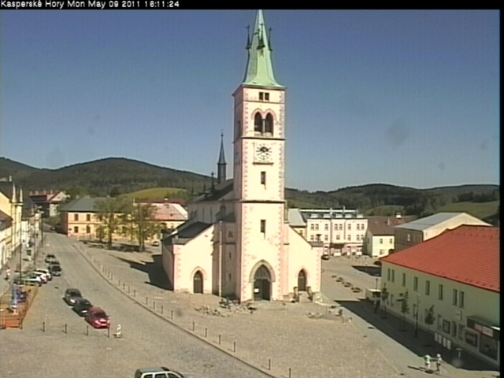
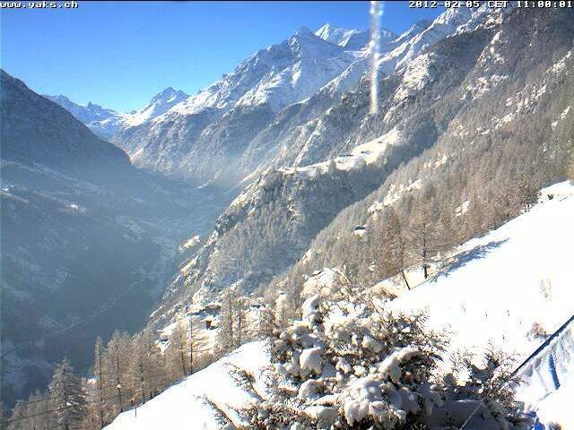
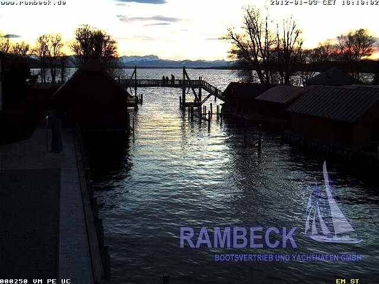
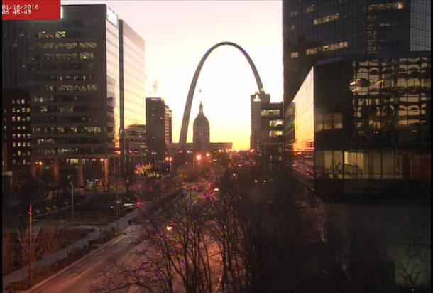
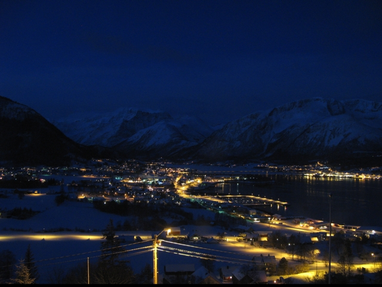
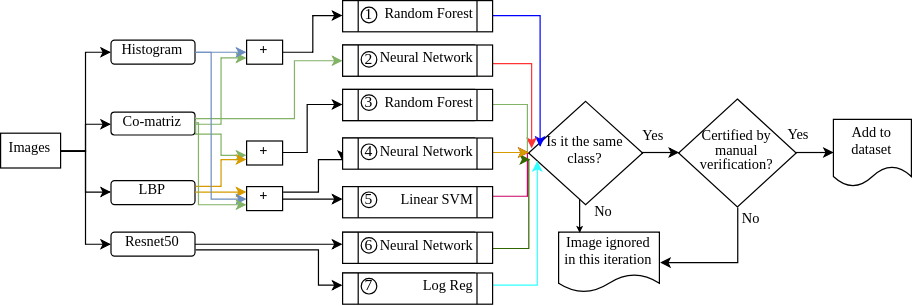
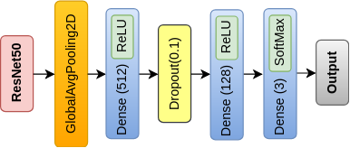
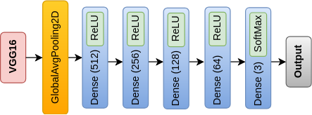
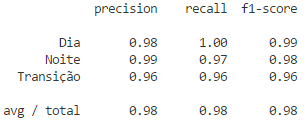

# Night-Day Image Classification

Application of several techniques of data collection and labeling, Machine Learning and Deep Learning to solve the problem, which aims to classify an image in one of three classes: day (the first two images), transition (the third and fourth ) and night (last two). The accuracy obtained in the best model for this problem was 98%.

For more information, read Report.pdf (in Portuguese) or contact me.

### Datasets
* Transient (http://transattr.cs.brown.edu/);
* AMOS (http://cs.uky.edu/~jacobs/datasets/amos/);
* Barcelona (http://www.cs.unc.edu/~jtighe/Papers/ECCV10/);
* Places (https://ieeexplore.ieee.org/document/7968387).

## Extracted Samples

### 
 Day 

  

  

### 
 Transition 

  

  

### 
 Night 

  

  

### Features extraction

(I) - Histogram, (II) o GLCM. 
F1-score over 20% of the data - cross validation.

| Classifier       |   I       |   II      |   I + II    |
| ---- | ------| ------| -----|
| Linear SVM          |   84.81% |   88.70% |   90.85%   |
| Decision Tree       |   82.17% |   82.52% |   85.39%   |
| Random Forest       |   88.89% |   88.87% |   90.81%   |
| Neural Network      |   87.72% |   92.18% |   91.74%   |
| Naive Bayes         |   79.05% |   68.89% |   69.66%   |
| Logistic Reg        |   84.80% |   86.66% |   90.69%   |

(III)  - Local Binary Pattern (LBP)

| Classifier       |   III     |   II + III  |  I + II + III  |
| -----| ------| ------| ------|
| Linear SVM          |   82.82% |   89.39% |   90.15%|
| Decision Tree       |   76.66% |   84.44% |   84.67%|
| Random Forest       |   80.00% |   91.36% |   90.72%|
| Neural Network      |   84.92% |   92.89% |   92.28%|
| Logistic Reg        |   83.18% |   87.98% |   88.57%|

### Features from deep model

| Classifier       |   ResNet50    |   IncV3       |  Xcp  |
| ---------| --------| -----------| -----------| 
| Linear SVM          |   94.77%     |   92.66%     |   91.85%|
| Random Forest       |   91.87%     |   79.39%     |   76.17%|
| Neural Network      |   95.73%     |   91.68%     |   90.20%|
| Logistic Reg        |   95.24%     |   68.79%     |   80.07%|

### Increasing the dataset

  

### Meta Learning

Results for each classifier:

| Classifier   |   accuracy    |   f1-score | 
| ------| -------| ------| 
| 1               |   94.39%     |   94.39%     |
| 2               |   95.79%     |   95.76%     |
| 3               |   94.20%     |   94.20%   | 
| 4               |   95.98%     |   95.96%     | 
| 5               |   94.84%     |   94.80%     |
| 6               |   97.51%     |   97.50%     |
| 7               |   97.45%     |   97.44%   |  

Meta classifier:

| Classifier       |   accuracy   |   f1-score   |
| -----------| ---------| ---------------|  
| Linear SVM          |   97.13%     |   97.13%     |
| Decision Tree       |   98.08%     |   98.08%     |
| Random Forest       |   98.02%     |   98.02%     |
| Neural Network      |   96.68%     |   96.70%     |
| Logistic Reg        |   96.81%     |   96.82%     | 

### Transfer Learning - ResNet50 with ImageNet

  

| Train | Val |
| ----- | ------ |
| Loss   | Accuracy    |    Loss           |  Accuracy             | 
| 0.2789 |      90% |   1.2179         |    80.00%             | 

### Trasnfer Learning - VGG16 with Places

  

| Train | Val |
| ----- | ------ |
| Loss   | Accuracy    |    Loss           |  Accuracy             | 
| 0.3222 |      97.14% |    0.3469         |    96.07%             | 

## Results

  

|           | Predict Day | Predict Night | Predict Trans |
|-------|------|-------|--------|
| Day       | 589         | 0             | 1             |
| Night     | 3           | 562           | 15            |
| Trans     | 9           | 7             | 384           |

# About the source code
* PARAMETERS
    * In order to correctly execute the codes, some parameters must be configured as described below.
    * In util.py
        * Paths of the datasets;
        * num_cores: used in processing. All the 'hot' functions of this work were paralleled, and all use this parameter;
    * In train.py
        * MODEL_ACTION
            * TEST_ALL_CLASSIFIERS - Tests all classifiers under selected features;
            * TEST_BIG_CLASSIFIER  - Train/Test the 'big' classifier presented and explained in the paper;
                * IMAGE_ROTULATION - Labeling of New images with the 'big' classifier, being the image added to the dataset only if all classifiers labeled with the same class;
                * AMOS - Labeling data of the dataset AMOS;

* The files have documentation summarized in all their functions.

* Files
    * deep_learning_train.py: Train CNNs with fine tuning;
    * feature_extraction_CNN.py: Feature extraction with CNNs;
    * feature_extraction.py: Feature extraction with histogram, co-matrix e LBP;
    * process_dataset_AMOS.py: Data processing functions for the AMOS dataset;
    * process_dataset_nexet.py: Data processing functions for the Nexet dataset;
    * process_dataset_transient.py: Data processing functions for the Transient dataset;
    * train.py: Train all classifiers (the features have already been extracted, except in the case of deep models);
    * util.py: Several "general purpose" functions that were required during this work;
    * vgg16_places_365.py: Pre-trained model vgg16_places_365.

